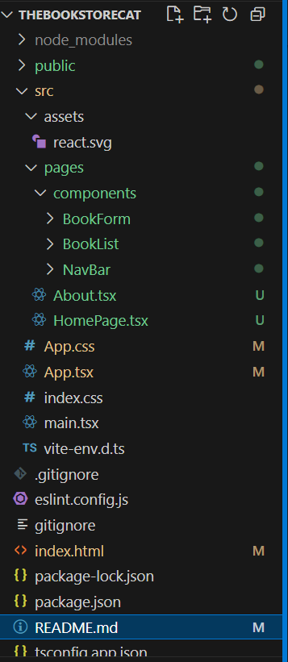

# The Bookstore Cat - Projeto de Desenvolvimento de Sistemas Frontend

**Aluno:** Gabriela de Castro Laurindo

**Matrícula:** 24150338-2

**Curso:** Análise e Desenvolvimento de Sistemas - Full-Stack e Mobile

**Instituição:** PUCRS - Pontifícia Universidade Católica do Rio Grande do Sul

## Descrição do Projeto

Este projeto é a Fase 1 do trabalho prático da disciplina de Desenvolvimento de Sistemas Frontend. Ele consiste em um aplicativo web para gerenciamento de livros, permitindo a listagem, cadastro, edição e exclusão de livros. O projeto foi desenvolvido utilizando React, TypeScript e Vite.

## Tecnologias Utilizadas

* React
* TypeScript
* Vite
* HTML
* CSS

## Componentes

* **BookList:** Componente responsável por exibir a lista de livros, com a possibilidade de excluir e editar itens.
* **BookForm:** Componente que contém o formulário para adicionar ou editar um livro. Possui campos para Título, Autor, Gênero e Data da leitura.
* **NavBar:** Componente de navegação que contém links para as diferentes seções do aplicativo.

## Funcionalidades Implementadas

* **Listagem de Livros:** Exibe os livros cadastrados em uma lista.
* **Cadastro de Livros:** Permite adicionar novos livros através de um formulário.
* **Edição de Livros:** Permite editar as informações de um livro existente.
* **Exclusão de Livros:** Permite excluir um ou mais livros selecionados.
* **Validação Básica do Formulário:** Verifica se os campos obrigatórios foram preenchidos.
* **Feedback Visual para o Usuário:** Indica ao usuário se os campos do formulário foram preenchidos corretamente.
* **Persistência Local:** Os livros cadastrados são armazenados no `localStorage` para manter os dados entre sessões.

## Imagens da Aplicação

Estrutura:

Telas:

**(Inserir a imagem 0fc4b5333dae2e05bc8541cf054b09a5.jpg)**

## Instalação e Execução

1. **Clone o repositório:** `git clone https://github.com/gabicastrum/thebookstorecat.git`
2. **Navegue até a pasta raiz do projeto:** `cd thebookstorecat`
3. **Instale as dependências:** `npm install`
4. **Inicie o servidor de desenvolvimento:** `npm run dev`

A aplicação estará disponível em `http://localhost:5173` (ou em outra porta, se configurado diferentemente).
